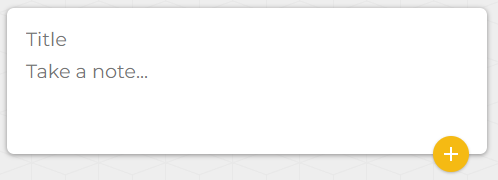
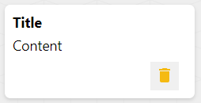
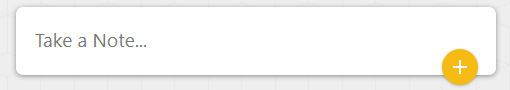

---
# $~~~~~~~~~~~~~~~~~~~~~~~~~~~~~~~~$ KEY POINTS

+ Project setUp
+ Material UI
+ Header Component
+ Create Area Component
+ Note Component
+ Footer Component
+ Done
---
# $~~~~~~~~~~~~~~~~~~~~~~$ Framework and Technology

+ Components
+ Project Structure
+ State Management
+ React Props
+ Spread operator
+ Arrow funtion
+ Material UI
+ React Hook
---
# $~~~~~~~~~~~~~~~~~~$ How to install new react App

### Syntax : npx create-react-app todolist

+ while creating any react app be sure the name of the app always should be lowercase

---
# $~~~~~~~~~~~~~~~~~~~~~~~~$ Component Creation
+ Create a folder as components inside the src and How many component you want to create
all should be inside the component folder.

### Rules to create a component
+ The component name should be Pascal case and make the file name same as the function name..
+ make sure to export the component so you can able to use it any place.


---
# $~~~~~~~~~~~~~~~~~~$ Create a component as Header.js
Here we are going to use Material-UI for Icons

so to install that you have to use the syntax:
npm install @mui/icons-material @mui/material @emotion/styled @emotion/react
where ever you want to use the Icon you have to Import the Icon otherwise you cannot..

## Let me give one example of using Highlight Icon

```
import HighlightIcon from '@mui/icons-material/Highlight';
```
---
# Header.js
In the Header component we need one header element and inside the header element one heading as ToDo List and one Icon should be there..
```
 <header>
    <h1>
    <HighlightIcon/>
     ToDoList
    </h1>            
</header>
```
 Export the Header component and use it in App.js
 Once you will get the outPut you can apply Css According to You
 
 ---

# Create a Component as Footer.js

#### Create a Date Constructor and assign into a variable
```
const date= new Date()
```
```
 <footer>
<p>Copyright{date.getFullYear()}.</p>
 </footer>
```

Export this Footer component and use it in App.js
Once you will get the outPut you can apply Css According to You

 ---

# Create a Component as CreateArea.js
+ Here we need one input field for Title and one TextArea for content

```
 <form className="create-note">
        <input type="text" name="title" placeholder="Title" />
        <textarea name="content" placeholder="Take a Note..."></textarea>
       <Fab color="primary" aria-label="add">
            <AddIcon />
       </Fab>
 </form>

```
You can apply css according your need but here let me show the example of output.

 ---

# It should be looks like this


 ---

# Create a Component as Note.js
Here you can add some dummy data which we can return when the User click on AddIcon button

+ Lets create the UI first later we will apply functionality over here..
```
 <div className='note'>
    <h1>Title</h1>
    <p>Content</p>
    <button>
    <DeleteIcon/>
    </button>
 </div>

```
---

# It should be looks like this


 ---

# Now we will start the Hooks concept and we will learn here by using useState hook how to change the state of components 
# useState Hook
+ Syntax to declare UseState Hook
```
 const [count, setCount] = useState()
```
---

# let me give you one Example of useState Hook
```
import React, { useState } from 'react';

function Example() {
  const [count, setCount] = useState(0);

  return (
    <div>
      <p>You clicked {count} times</p>
      <button onClick={() => setCount(count + 1)}>
        Click me
      </button>
    </div>
  );
}
```
---

# Now lets start using useState hook in CreateArea.js
+ intially the state value should be empty string

```
const [note, setNote] = useState({
  title:"",
  content:""
});

```
+ setNote is the function which is responsible to update the state..
+ By using event.target we can get what ever data we have passed to each field and that data if we pass to the setNote the initial value will Update to new value.

+ to get indivisual name and value we can destructure the data from event.target

 ---

# Let me show you one example of Array Destructuring

### Basically destructuring means extracting the array/object elements and storing into indivisual variables..

```
const vehicles = ['mustang', 'f-150', 'expedition'];

const [car, truck, suv] = vehicles;

```

---

# Lets destructure name and value from event.target
```
 const { name, value } = event.target;
```
+ Now we can get the name and value for each field and we can set in setNote function..
# Lets Come to the topics Spread operator
+ Let me show one example first
```
const numbersOne = [1, 2, 3];
const numbersTwo = [4, 5, 6];
const numbersCombined = [...numbersOne, ...numbersTwo];
```
---

# Adding onChange event to each field 

```
 <form className="create-note">
        <input type="text" name="title" placeholder="Title" onChange={handleChange} value={note.title} />

        <textarea name="content" placeholder="Take a Note..." onChange={handleChange} value={note.content}/>
       <Fab color="primary" aria-label="add">
            <AddIcon />
       </Fab>
 </form>

```

+ Call the function by using onChange event handler

---

# Create an Arrow function as handleChange and add the functionality here..
```
let handleChange=((event)=>
{
  const { name, value } = event.target;
  setNote((prevNote)=>
  {
    return{
      ...prevNote,
      [name]:value
    }
  })
})
```
+ Now  Here setNote method will update the value and store in note variable every time

---

# Lets add one more event as onClick to the button for submit the note..

```
 <Fab color="primary" aria-label="add" onClick={submitNote}>
   <AddIcon />
 </Fab>
```

---

# Lets add Submit Button Functionality
+ So here lets create a function as submitNote and whenever we click the button it will return as a new Note component everytime and the value will update to empty string..
```
let submitNote=((event)=>{
setNote({
  title:"",
  content:""
})
event.preventDefault();
})
```

---
# Lets come to App.js 

+  In App.js we can use the useState Hook where the intial value of the state will be an empty Array..
```
const [notes,setNotes] = useState([]);
```
+ we can store each note in the newNotes method and by using map method we can iterate each notes and also we can return that..
+ Here you should know the concept of Props because  by using props we can send the data from one Component to another

# So tell me What Is Props ?

---

# Props

The word “props” implies “properties”, and its working functionality is quite similar to HTML attributes. Basically, these props components are read-only components

+ We can pass anything (string,Array,Object,Function) as a props..
 
+ so here In App.js lets pass a method addNote as a props to the createArea Component..
```
<CreateArea onAdd={addNote}/>
```

+ So now to use the method in CreateArea Component we have to pass props as a parameter to CreateArea function..

---

## Pass the updated note variable to the addNote method as a parameter so we can use it in App.js

```
let submitNote=((event)=>
{
props.onAdd(note)
setNote({
  title:"",
  content:""
})
event.preventDefault();
})
```

---

+ Lets create a method as addNote and add the functionality here

```
let addNote=((newNote)=>
  {
    setNotes(prevNotes=>
      {
        return [...prevNotes,newNote]
      })
  })
```
+ Here the newNote holds all the new data and the prevNotes holds all the old data
+ so in return statement we can return all the data by using spread operator..

---

# Using map method iterate each note and return the Note Component
```
 {notes.map((noteItem,Index)=>
     {
      return(
        <Note key={Index} id={Index} title={noteItem.title} content={noteItem.content}/>
      )
     })}
```
+ Here we are passing title,content as a props so that In Note Component we can get it and by using props.title and props.content..

---

# Lets come to the Note.js Component

+ In the function pass the props as parameter and use it where you need
```
<h1>{props.title}</h1>
<p>{props.content}</p>
```


---

# Lets add the Delete functionality
+ So there is one delete Icon button in Note.js Component so lets use the event onClick and call the method handleClick..

```
<button onClick={handleClick}>
 <DeleteIcon/>
</button>
```
+ Create a function as handleClick and add functionality here to delete the Notes

```
  let handleClick=(()=>{
       
    })
```
### here the Question is What should be the functionality here to delete Notes ??

---

# Lets Come to App.js

+ In App.js the setNotes method stores all the Notes so by using filter method we can set the delete functionality here 

```
let deleteNote=((id)=>
  {
    setNotes(prevNotes=>
      {
        return prevNotes.filter((noteItem,Index)=>
        {
          return Index!==id
        });
      });
  })
```
## Now pass the deleteNote method as a Props to Note.js

---

# Lets pass the method deleteNote as props
```
 <Note key={Index} id={Index} title={noteItem.title} content={noteItem.content} onDelete={deleteNote}/>
```
+ now we can use the prop name as onDelete in Note.js 
```
 let handleClick=(()=>
    {
        props.onDelete(props.id)
    })
```

---

# Lets add one more interesting part through which we can expand the fields

## So initially our output should looks like this(only text-field)


## Once you will click on the text-field then the input field will be there 

---

# After click the output should looks like this

## So the Question is what functionality we have to use here ??

---

# using useState hook we can set the functionality here

+ So first the intial value of the State should be false (boolean value)
+ After clicking the text-field it should change to true (boolean value)
+ So by using onClick event we can call the method
+ Lets create a method and set the Functionality which changes the state false to true.

---

# Lets declare the useState in App.js
```
const [isExpanded, setExpanded] = useState(false);
```
+ So here the initial value of state is false

## Lets create a function and change the functionality to true
```
function expand() {
    setExpanded(true);
  }
```
+ Now call this function in the text-field by using onClick event

---

# Now add the functionality to input-field

+ It means while the state value is true then only the Input field should apper otherwise not

## Let me show you how to add that functionality
```
 {isExpanded && (
          <input
            name="title"
            onChange={handleChange}
            value={note.title}
            placeholder="Title"
          />
  )}
```
---

# At last we can add a small changes here to the text-area 

+ We know there is one attribute for text-area is row..

+ So While the state changes to true lets set the row value to 3 otherwise set it to 1

### So now lets add the attribute to the text-area

```
  rows={isExpanded ? 3 : 1}
```

---
# Finally We have Completed our Project ToDo-App
---


